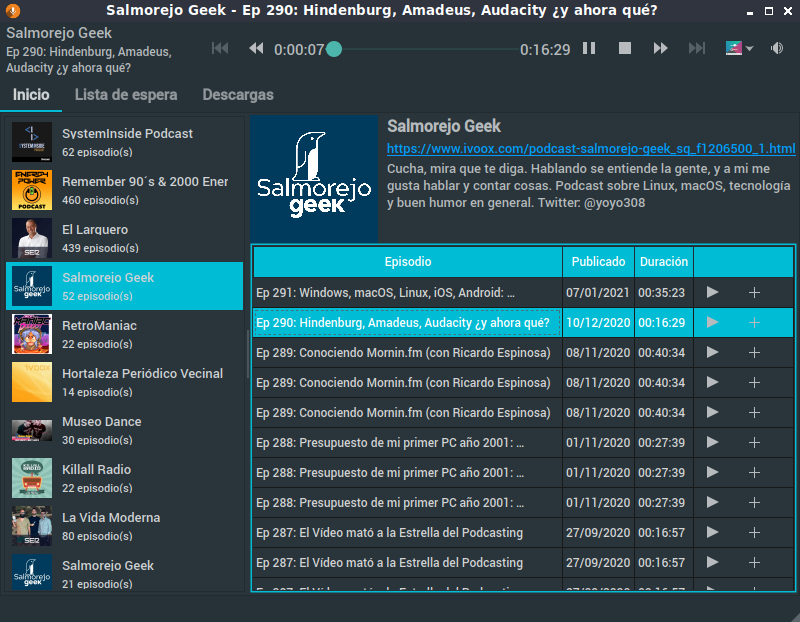

# Minimal Podcasts Player

(c) 2021 Alfonso Saavedra "Son Link"

https://github.com/son-link/minimal-podcasts-player

Subscribe, listen and (in the future) download your favorite podcasts, quickly and easily.

Available for Linux, Windows and Mac.

Licensed under GNU/GPL3 or higher.

Note: this project is still under development, so some features are not yet available or complete.

## Install

### From source code:

* Clone the repo, download the zip under Code -> Download ZIP or download the last release.
* Open a terminal and go to the project folder.
* Install the dependencies:
  * From PIP (with administration permissions): `python3 -m pip install -r requirements.txt`
  * Debian/Ubuntu/Mint/MX Linux:
    * apt: `apt install python3-pyqt5, python3-pyqt5.qtmultimedia, libqt5multimedia5, libqt5multimedia5-plugins`
    * Pypi: `pip3 install podcastparser qt-material`
  * Arch Linux/Manjaro:
    * pacman: `python-pip python-podcastparser python-pyqt5 qt5-multimedia`
    * Pypi `pip3 install qt-material`

### Executables:

You can download a **AppImage** for **GNU/Linu**x and **executable** for **Windows** on (releases)

If you use Arch Linux, Manjaro or other Arch based distros a package is avaliable on [AUR] (soon)

## Other credits:

* [App icon](https://pixabay.com/es/illustrations/podcast-popular-muestra-anuncio-2665175/
) (temporary) make by [BedexpStock](https://pixabay.com/es/users/bedexpstock-6161331/) and licensed under Pixabay License(https://pixabay.com/es/service/license/)

* no-cover.svg image and the icon theme make by me using a [Material Design Icons](https://material.io/resources/icons/) from Google and licensed under Apache license version 2.0.

Theme app: [qt-material](https://github.com/UN-GCPDS/qt-material)