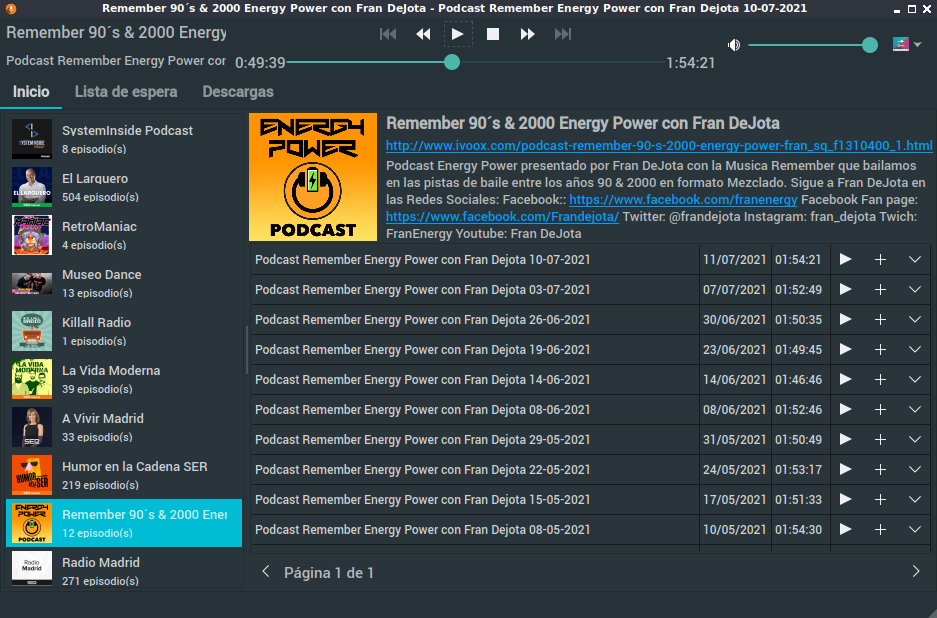

# Minimal Podcasts Player

[https://github.com/son-link/minimal-podcasts-player](https://github.com/son-link/minimal-podcasts-player)

Subscribe, listen and (in the future) download your favorite podcasts, quickly and easily.

Available for Linux, Windows and Mac.

Licensed under GNU/GPL3 or higher.

**Note**: this project is still under development, so some features are not yet available or complete.

## Install

### From source code:

* Clone the repo, download the zip under Code -> Download ZIP or download the last release.
* Open a terminal and go to the project folder.
* Install the dependencies:
  * **From PIP** (with administration permissions): `pip install -r requirements.txt`
  * **Debian/Ubuntu/Mint/MX Linux**:
    * apt: `apt install python3-pyqt5, python3-pyqt5.qtmultimedia, libqt5multimedia5, libqt5multimedia5-plugins`
    * Pypi: `pip3 install podcastparser`
  * **Arch Linux/Manjaro**:
    * pacman: `python-pip python-podcastparser python-pyqt5 qt5-multimedia`
    * Pypi `pip install`

  * Copy bin/minimal-podcasts-player.desktop to /usr/share/applications
  * Copy bin/minimal-podcasts-player.svg to /usr/share/pixmaps

  * **Windows**:
    *  Install Python, or Conda/Miniconda.
    *  Open a terminal (cmd or Poweshell) and execute `pip install -r requirements.txt`

  **Note:** if you use **Conda/Miniconda**, **DON'T** install the package **pyqt** from conda and conda-forge repositories, install it from Pypi, since the one installed from them does not include the libraries for multimedia playback.

### From Pypi:

`pip install minimal-podcasts-player`

### Executables:
You can download a **AppImage** for **GNU/Linux** and **executable** for **Windows** on [releases page](https://github.com/son-link/minimal-podcasts-player/releases)

If you use Arch Linux, Manjaro or other Arch based distros a package is avaliable on [AUR](https://aur.archlinux.org/packages/minimal-podcasts-player/)

## Other credits:

* [App icon](https://pixabay.com/es/illustrations/podcast-popular-muestra-anuncio-2665175/
) (temporary) make by [BedexpStock](https://pixabay.com/es/users/bedexpstock-6161331/) and licensed under [Pixabay License](https://pixabay.com/es/service/license/)

* no-cover.svg image make by me using a [Material Design Icons](https://material.io/resources/icons/) from Google and licensed under Apache license version 2.0.
